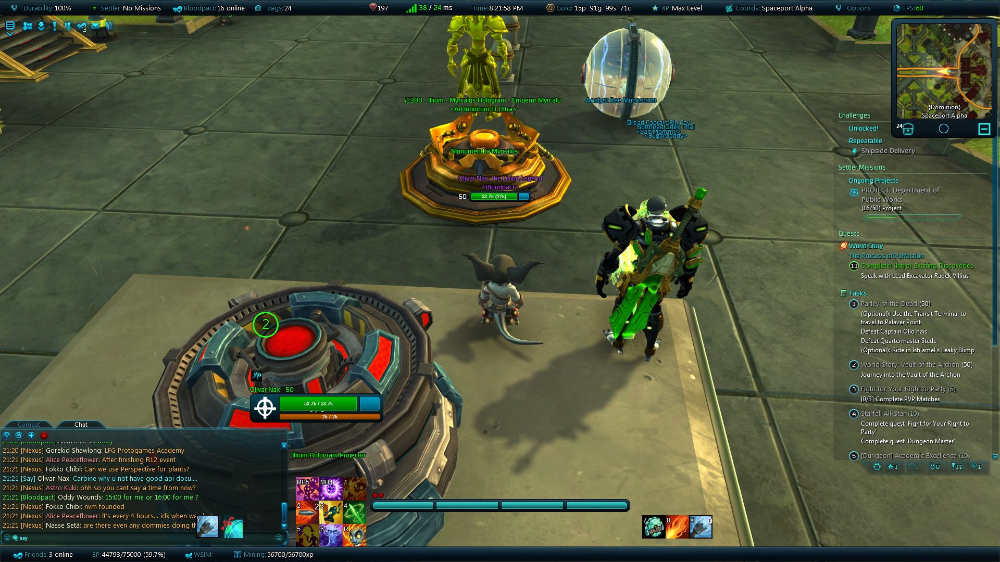

CandyUI
======

A Wildstar UI Replacement

## Commands

- */candyui* or */cui* to bring up the options

## Window Management
All management of the various windows and unitframes is controlled through Carbine's WindowsManager.
If you want to prevent windows from moving, or make them movable,
then use the *escape* -> *Interface* -> *Positioning* options of the client.

